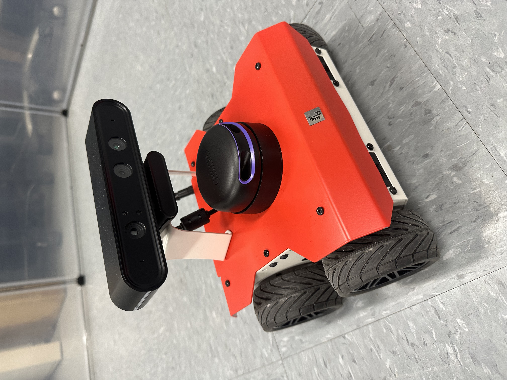
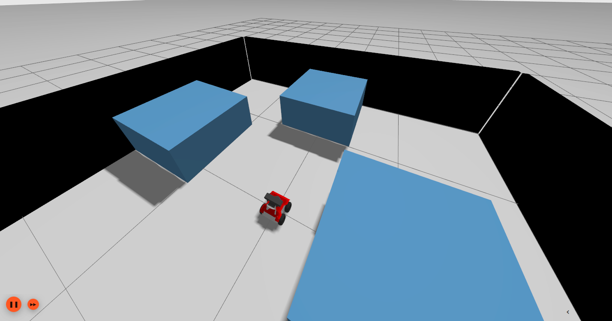
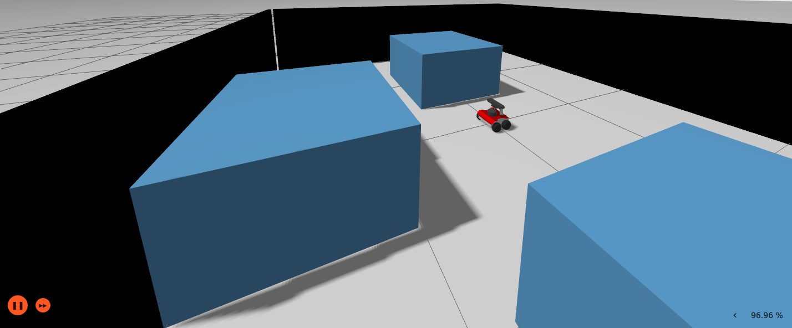
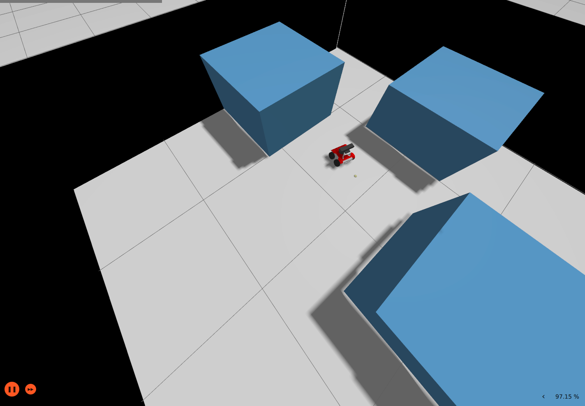
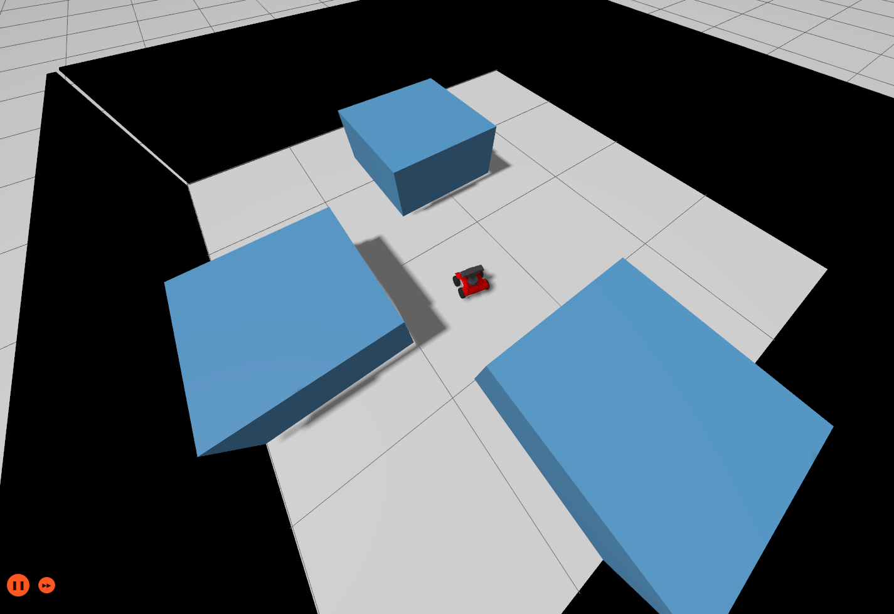
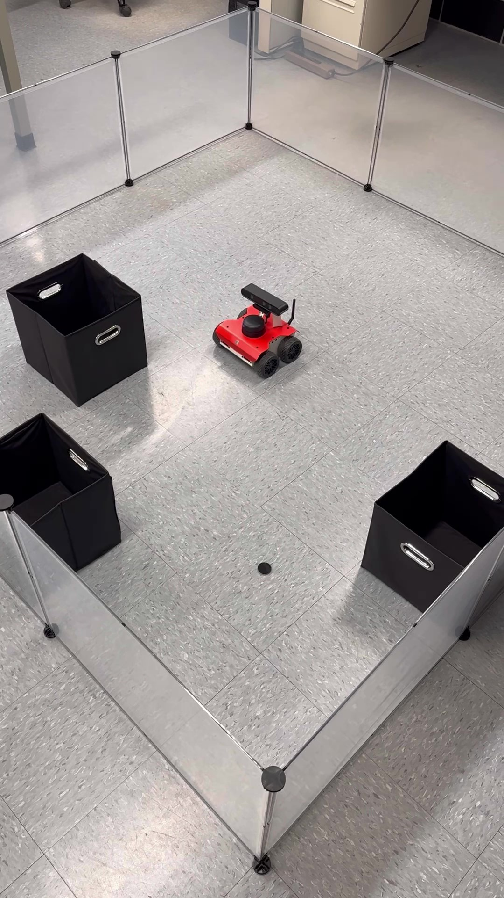
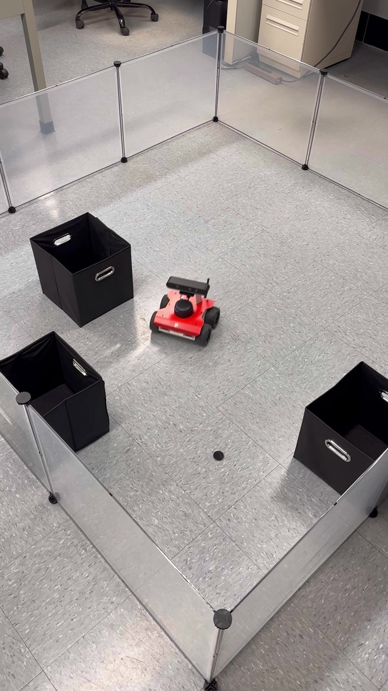
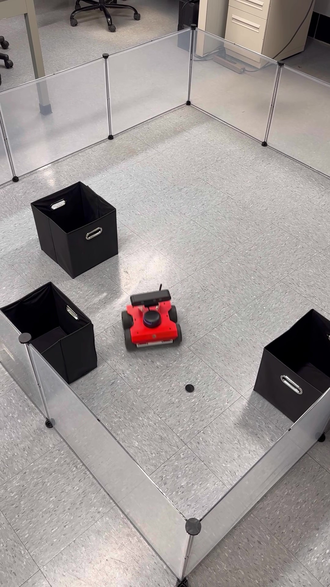
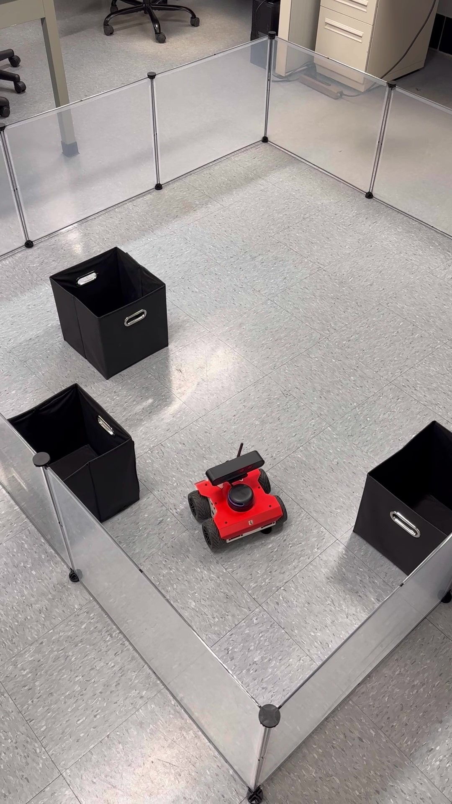

# Risk-Informed Model-Free Safe Control of LPV Systems

This repository contains code and documentation for the paper:

**Title**: Risk-Informed Model-Free Safe Control of Linear Parameter-Varying Systems  
**Authors**: Babak Esmaeili and Hamidreza Modares  
**Published in**: IEEE/CAA Journal of Automatica Sinica, Vol. 11, No. 9, Sept. 2024  
**DOI**: [10.1109/JAS.2024.124479](https://doi.org/10.1109/JAS.2024.124479)

---

## 🧠 Abstract

This paper presents a risk-informed data-driven safe control design approach for a class of stochastic uncertain nonlinear discrete-time systems. The nonlinear system is modeled using linear parameter-varying (LPV) systems. A model-based probabilistic safe controller is first designed to guarantee probabilistic λ-contractivity (i.e., stability and invariance) of the LPV system with respect to a given polyhedral safe set. To obviate the requirement of knowing the LPV system model and to bypass identifying its open-loop model, its closed-loop data-based representation is provided in terms of state and scheduling data as well as a decision variable. It is shown that the variance of the closed-loop system, as well as the probability of safety satisfaction, depends on the decision variable and the noise covariance. A minimum-variance direct data-driven gain-scheduling safe control design approach is presented next by designing the decision variable such that all possible closed-loop system realizations satisfy safety with the highest confidence level. This minimum-variance approach is a control-oriented learning method since it minimizes the variance of the state of the closed-loop system with respect to the safe set, and thus minimizes the risk of safety violation. Unlike the certainty-equivalent approach that results in a risk-neutral control design, the minimum-variance method leads to a risk-averse control design. It is shown that the presented direct risk-averse learning approach requires weaker data richness conditions than existing indirect learning methods based on system identification and can lead to a lower risk of safety violation. Two simulation examples along with an experimental validation on an autonomous vehicle are provided to show the effectiveness of the presented approach.

---

## 🎯 Overview

This work develops a robust, risk-informed, model-free safe control framework for LPV systems using only I/O data:
- **Data-driven closed-loop representation**: Bypass open-loop model identification by directly using collected state-input-scheduling data under gain-scheduling feedback.
- **Probabilistic safety**: Guarantee λ-contractivity of polyhedral safe sets in probability under Gaussian disturbances.
- **Risk-averse design**: Formulate and solve optimization (LP/SDP) to minimize variance of closed-loop behavior w.r.t. safe set, improving safety confidence.
- **Data efficiency**: Requires weaker data-richness conditions compared to model-based identification.
- **Practical validation**: Two examples demonstrate effectiveness:
  1. **Magnetic suspension system**: MATLAB scripts compute safe-control gains ensuring constraints on position and velocity.
  2. **Robotic vehicle set-point tracking**: MATLAB-computed gains are used in a Python ROS 2 node for real-time deployment on a mobile robot; includes Gazebo simulation and real-world experiments.

---


---

## 🛠 Requirements

- **Python 3.8+**, **ROS 2** (Humble) and related packages: for deploying the ROS 2 node.
- **Gazebo**: for simulation of the robotic vehicle.
- **NumPy**, **rclpy**, **nav_msgs**, **geometry_msgs**, etc.: Python dependencies for ROS 2 node.
- A mobile robot platform compatible with ROS 2 for real-world validation.

---

---

## 📜 License and Contact

This project is licensed under the MIT License – see [LICENSE](LICENSE) for details.

For questions or collaboration, contact:
- **Babak Esmaeili** – esmaeil1@msu.edu

---

## 📚 Citation

If you use this repository, please cite:
```bibtex
@article{esmaeili2024riskinformed,
  title={Risk-Informed Model-Free Safe Control of Linear Parameter-Varying Systems},
  author={Esmaeili, Babak and Modares, Hamidreza},
  journal={IEEE/CAA Journal of Automatica Sinica},
  volume={11},
  number={9},
  pages={1918--1932},
  year={2024},
  doi={10.1109/JAS.2024.124479}
}
```

---

## 📸 Visuals

<!-- Single photo of the robot -->
<p align="center">
  
  <br/>
  <em>Physical robot used in experiments (Rosbot 2R).</em>
</p>

<!-- 2 × 2 grid: Gazebo simulations -->
<table align="center">
  <tr>
    <td></td>
    <td></td>
  </tr>
  <tr>
    <td></td>
    <td></td>
  </tr>
</table>
<p align="center"><em>Gazebo environment snapshots.</em></p>

<!-- 2 × 2 grid: real-world implementation -->
<table align="center">
  <tr>
    <td></td>
    <td></td>
  </tr>
  <tr>
    <td></td>
    <td></td>
  </tr>
</table>
<p align="center"><em>Real-world robot implementation snapshots.</em></p>


